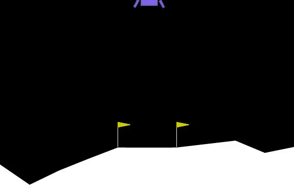
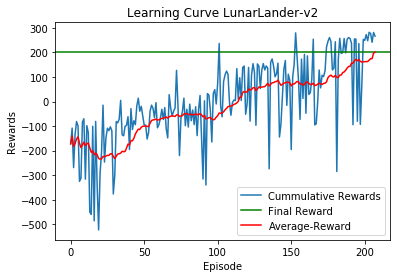
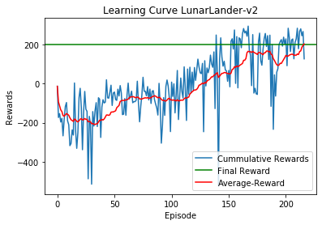

# Lunar Lander: Deep Q-Learning (DQN) and Double Deep Q-Learning (DDQN)


## Overview

This project implements **Deep Q-Learning (DQN)** and **Double Deep Q-Learning (DDQN)** to train an agent to solve the **Lunar Lander** problem, a classic **Reinforcement Learning** task from OpenAI's Gym. The objective is to safely land a spacecraft between two flags using a variety of controls.

Key results demonstrate that both algorithms can solve the environment, with a detailed comparison between DQN and DDQN in terms of convergence and regret metrics.

## Features of the Lunar Lander Environment

- **Goal**: Safely land the spacecraft between two flags.
- **Actions**: Fire main engine, left engine, right engine, or do nothing.
- **States**: The agent observes 8 parameters, including position, velocity, and whether the legs are grounded.
- **Rewards**: Rewards are based on proximity to the target, engine usage, and safe landing.
  
The environment is considered solved if the agent achieves an average score of **200** or more over the last **100 episodes**.

---

## Algorithms

### 1. **Deep Q-Learning (DQN)**

In DQN, the agent learns to estimate the optimal action-value function (Q-values) using a deep neural network, with experience replay and a target network to stabilize training.

### 2. **Double Deep Q-Learning (DDQN)**

DDQN builds upon DQN by addressing **overestimation bias** in action-value estimation. This improves the stability and performance in certain environments, though, in the case of Lunar Lander, the results show minimal difference between DQN and DDQN due to the simplicity of the task.

---

## Hyperparameters and Training

The following hyperparameters were used in both DQN and DDQN:

- **Number of Episodes**: 250
- **Discount Factor (γ)**: 0.99
- **Learning Rate**: 0.0005
- **Replay Buffer Capacity**: 25,000
- **Exploration**:
  - Start Epsilon (ε): 1.0
  - End Epsilon (ε): 0.01
  - Epsilon Decay Rate: 0.99
- **Batch Size**: 64 (chosen based on convergence and regret metrics analysis)

---

## Results and Performance Comparison

### Training Process Visualization

Here’s the visualization of the training process for both DQN and DDQN.



### Learning Curves

#### DQN


#### DDQN


### Key Findings:

- **Convergence Rate**: The DQN and DDQN agents achieved convergence at a similar pace, with batch size 64 being the most effective across the trials.
- **Regret Metrics**: The difference between the optimal reward and the agent's average reward was minimal for both algorithms. DDQN showed no significant improvement due to the simplicity of the task.

### Reward Comparison

Below is the comparison of the **cumulative rewards** over the training episodes for DQN and DDQN:


---

## Future Work

While DQN and DDQN performed similarly in this problem, future improvements could include:
- Applying the algorithms to more complex environments.
- Implementing prioritized experience replay to speed up convergence.
- Testing alternative deep learning architectures or more sophisticated exploration strategies.

---

## Installation and Usage

### Installation

1. Clone this repository:
   ```bash
   git clone https://github.com/heydarimo/LunarLander-DQN-DDQN.git
   cd LunarLander-DQN-DDQN

2. Install the required dependencies:
   ```bash
   pip install -r requirements.txt

3. Run the project:
   ```bash
   python train.py

### Running the Experiments
1. To run DQN:
   ```bash
   python train.py --algorithm dqn


2. To run DDQN:
   ```bash
   python train.py --algorithm ddqn

## Technologies Used

- **Python** (TensorFlow, Keras, NumPy, OpenAI Gym)
- **Matplotlib** for visualizations
- **Experience Replay** and **Target Networks** for stabilizing training


## References

1. [OpenAI Gym: Lunar Lander](https://gym.openai.com/envs/LunarLander-v2/)
2. [Double Q-Learning Research Paper](https://arxiv.org/abs/1509.06461)- **Double Q-Learning**
